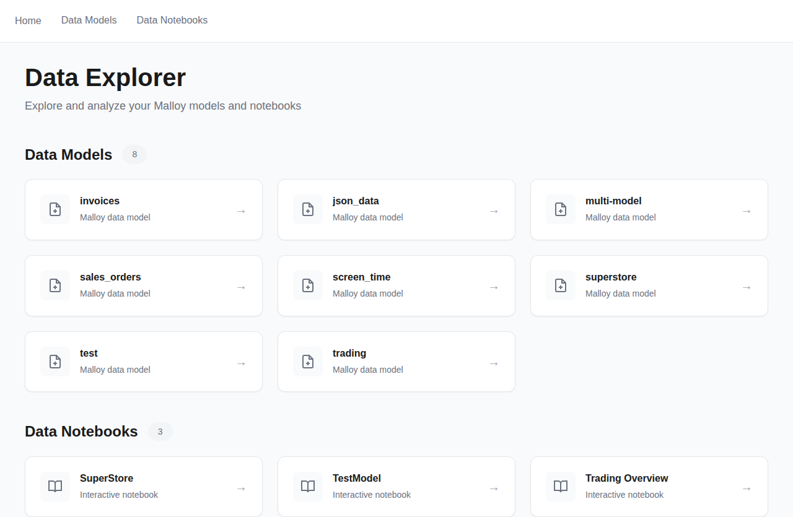
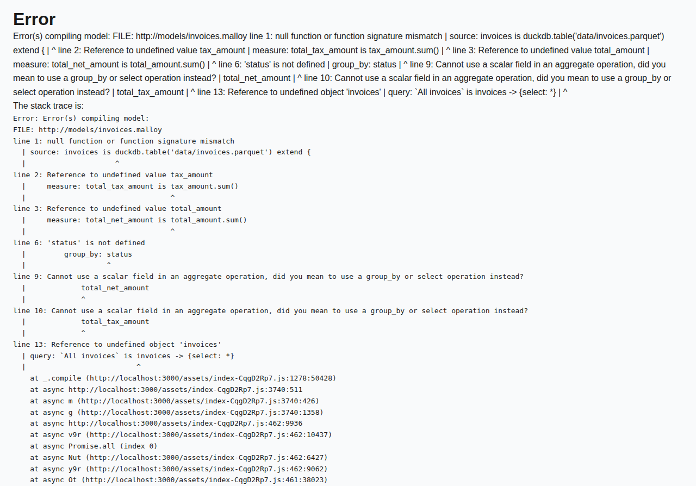
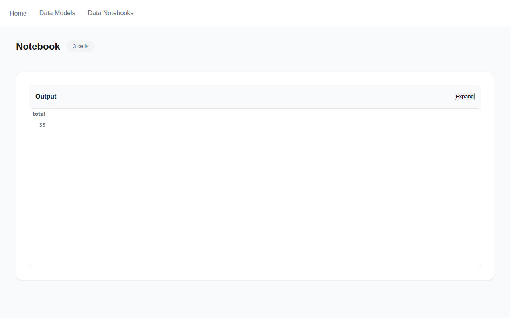

# Redesign Data Explorer UI with minimalistic approach

## Summary

Complete redesign of the Data Explorer UI with a clean, minimalistic approach focusing on organization and usability.

## Screenshots

### Home Page - Card-Based Layout


The new home page features:
- **Clean header** with title and subtitle
- **Card-based grid layout** for models and notebooks
- **Count badges** showing 8 models and 3 notebooks at a glance
- **Icon differentiation** - document icon for models, book icon for notebooks
- **Hover effects** with card elevation and arrow animation
- **Minimal color scheme** - white cards on light gray background with blue accents

### Model Page


### Notebook Page


## Key Changes

### Home Page
- ✨ Rich card-based layout for models and notebooks
- 📊 Count badges showing number of items
- 🎨 Icons for better visual distinction
- 🔄 Hover animations with card lift effect
- 📝 Empty states for when no models/notebooks exist

### Model Pages
- 🏷️ Dedicated header section with model name and type
- 📑 Better section organization (Named Queries, Data Sources)
- 🔘 Improved action buttons (Preview/Explore) with hover effects
- 📊 Count badges for queries and data sources
- 🎯 Clear visual hierarchy with section headers

### Schema Display
- 💎 Enhanced field and explore item styling
- 🔲 Better organized collapsible sections
- 🎨 Consistent color scheme throughout
- 🔘 Modern button styling with hover states

### Notebook Pages
- 📚 Clean header with cell count
- 🎴 Card-based cell layout
- 🔲 Better spacing and visual organization
- 📝 Improved empty states

### CSS/Design System
- 🎨 **Minimal color palette**: Grays (#f9fafb, #6b7280) with blue accent (#3b82f6)
- 📏 **Consistent spacing system** using CSS variables (--spacing-xs through --spacing-2xl)
- 🔘 **Subtle shadows** for depth (--shadow-sm, --shadow-md, --shadow-lg)
- ✨ **Smooth transitions** (0.2s) on all interactive elements
- 🎯 **System font stack** (-apple-system, BlinkMacSystemFont, Segoe UI, Roboto)
- 📱 **Responsive card grid** using CSS Grid (auto-fill, minmax(300px, 1fr))
- 🎭 **Focus on readability** with improved line-height (1.6) and font sizing

## Design Principles

- **Minimalism**: No unnecessary elements or decorations - every element serves a purpose
- **Consistency**: Uniform spacing, colors, and component styles across all pages
- **Organization**: Clear hierarchy and logical grouping of content
- **Usability**: Intuitive navigation and interaction patterns with visual feedback
- **Performance**: Plain CSS only, no frameworks - lightweight and fast

## Visual Improvements

- **Border radius** (4px, 8px, 12px) for softer, modern appearance
- **Box shadows** for card elevation and depth perception
- **Hover states** on all interactive elements with color/transform feedback
- **Count badges** for quick information architecture
- **Better whitespace** usage for improved readability
- **Improved contrast** between text levels (primary, secondary, tertiary)
- **Navigation indicators** with border-bottom on hover

## Technical Details

### CSS Variables Architecture
```css
/* Color System */
--color-text-primary: #1a1a1a;
--color-text-secondary: #6b7280;
--color-text-tertiary: #9ca3af;
--color-accent: #3b82f6;

/* Spacing System */
--spacing-xs: 0.25rem;  /* 4px */
--spacing-sm: 0.5rem;   /* 8px */
--spacing-md: 1rem;     /* 16px */
--spacing-lg: 1.5rem;   /* 24px */
--spacing-xl: 2rem;     /* 32px */
--spacing-2xl: 3rem;    /* 48px */
```

### Component Patterns
- **Cards**: White background, 1px border, 12px radius, subtle shadow, hover lift effect
- **Badges**: Pill-shaped (999px radius), light gray background, compact padding
- **Buttons**: Small size (0.875rem), hover state with accent color background
- **Headers**: Clear hierarchy with bottom border separators

## Test Plan

- [x] Built successfully with `npm run build`
- [x] All TypeScript types compile correctly
- [x] CSS uses only plain CSS (no frameworks)
- [x] Maintains existing functionality
- [x] Responsive layout works on different screen sizes
- [x] Screenshots captured using Playwright

## Files Changed

- `src/Home.tsx` - Complete redesign with card-based layout
- `src/Schema.tsx` - Enhanced with section headers and better organization
- `src/ModelHome.tsx` - Added dedicated header section
- `src/NotebookViewer.tsx` - Improved layout with header
- `src/index.css` - Complete CSS rewrite with design system
- `scripts/capture-screenshots.ts` - Automated screenshot generation

---

**Before/After Comparison**: The old design used simple lists with basic links. The new design transforms the interface into a modern, card-based layout with clear visual hierarchy, better information architecture, and polished interactions.
